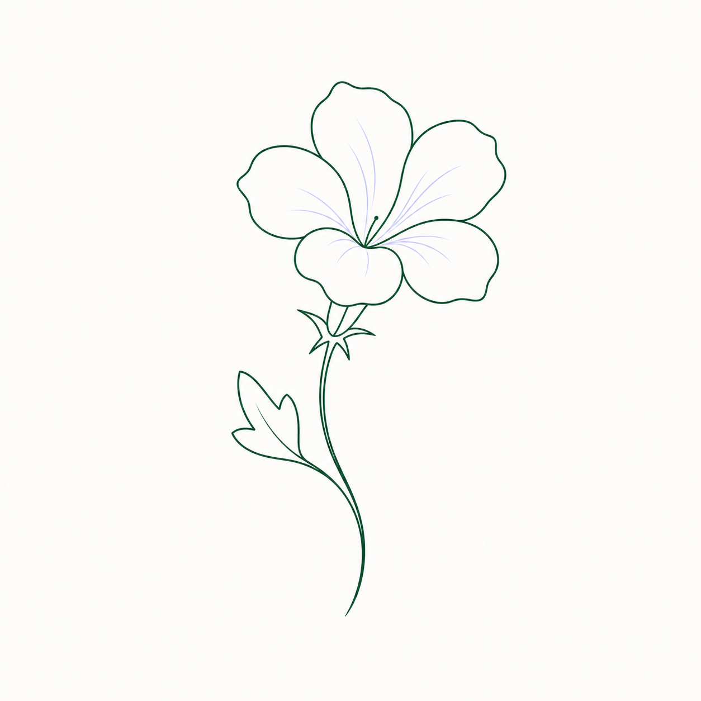

# Roselle

  

<h1 align="center">Roselle</h1>

  <strong>Restore image-born graphics into precise, editable SVG assets.</strong>

Roselle is an AI-orchestrated image-to-SVG restoration tool that turns raster images into precise, editable vector graphics.

Unlike ordinary one-click tracers, Roselle treats vectorization as a structured restoration process. It analyzes the source image, separates visual intent from bitmap noise, chooses the right toolchain for the material, and rebuilds shapes as clean SVG paths that designers and developers can inspect, edit, and reuse.

Roselle is designed for icons, logos, sketches, diagrams, line art, UI assets, ornamental patterns, and other image-born graphics where fidelity matters. Instead of simply approximating pixels, it works toward a deliberate vector result: fewer unnecessary nodes, smoother curves, clearer layers, consistent strokes, and SVG output that behaves like a crafted asset rather than an automated conversion artifact.

At its core, Roselle is an agentic workflow for visual reconstruction. AI is used as a coordinator, not as a magic filter: it can inspect the source image, decide whether to segment, trace, simplify, redraw, compare, or refine, and route each step through specialized tools. The goal is to preserve the character of the original image while producing a vector file that is lightweight, legible, and production-ready.

For the Fleur family, Roselle sits between visual understanding and design production. Iris helps read and interpret visual material. Convallaria helps shape brand and design systems. Roselle restores image-born forms into editable SVG paths.

## What Roselle Does

- Converts raster images into clean, editable SVG files.
- Reconstructs intended shapes rather than merely tracing pixels.
- Reduces noise, redundant nodes, and accidental bitmap artifacts.
- Produces smoother curves, clearer layers, and more consistent strokes.
- Coordinates multiple restoration tools through an AI-guided workflow.
- Supports visual assets such as logos, icons, sketches, diagrams, line art, and ornamental patterns.

## Philosophy

Roselle treats every conversion as a restoration task:

1. Preserve what matters.
2. Remove what does not.
3. Rebuild the image as a controllable vector asset.
4. Verify that the final SVG remains faithful, editable, and practical.

The result is not just a converted file. It is a restored design asset ready for design systems, websites, apps, documentation, and further creative work.
